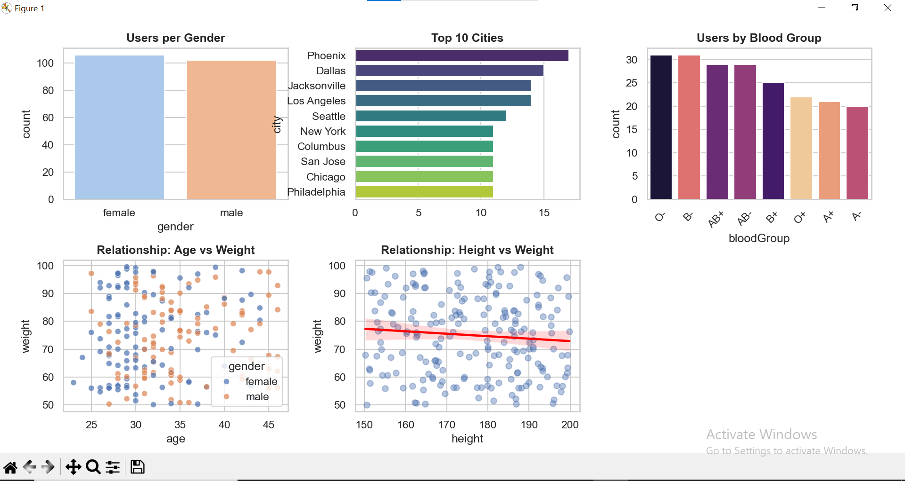

# 📊 User Data ETL & Analytics Pipeline (End-to-End)

This project demonstrates a complete **Data Engineering pipeline** built during my training at **ITI**. The system automates the process of extracting, transforming, and analyzing user data from the DummyJSON API.

## 🏗️ Architecture (ETL Process)
1. **Extract:** Fetching 208 users from API using **Pagination** (limit/skip).
2. **Transform:** Cleaning data, handling missing values (Imputation), and flattening nested JSON address fields.
3. **Load:** Saving the refined data into `cleaned_users.csv`.

## 🛠️ Technologies Used
- **Python** (Pandas, Requests)
- **Data Visualization** (Seaborn, Matplotlib)
- **GitHub** (Version Control)

## 📊 Dashboard Preview

## 🚀 How to Run
- Run `read.py` for extraction.
- Run `main.py` for cleaning and visualization.
